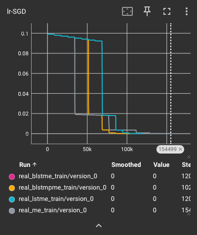
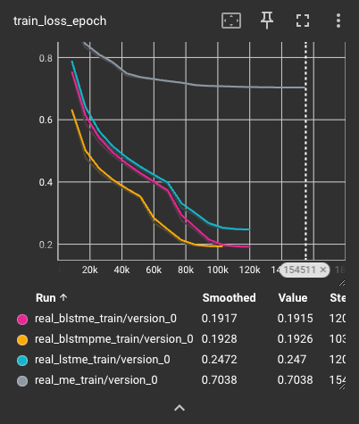
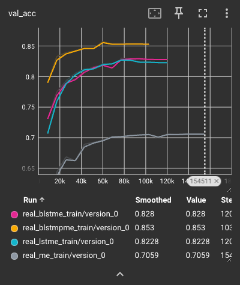

# Introduction

This report briefly comments on the results obtained reproducing the paper Supervised 
Learning of Universal Sentence Representations from Natural Language Inference Data 
by Conneau et al. (2018). In addition to this report, there is a demo notebook 
in `notebooks/demonstration.ipynb`, which includes an analysis of the two phrases that the model
incorrectly deems contradictory. 

# Models

Four different models were implemented. These models are the mean encoder, LSTM, BiLSTM, and 
BiLSTM with max pooling. All model dimensions are identical to those used by the authors. 

# Experimental setup

The experimental setup is, as far as possible, identical to the one in Conneau et al. (2018).
Models are trained with a batch size of 64, using SGD with a learning rate of 0.01. Two learning
rate schedulers are used as described by the authors, and training terminates when the learning
rate lowers below a threshold of 10e-5. This can be seen in the learning rate plots shown below. 

# Results

Results for the experiments are shown in this section. 

## SNLI

We start by inspecting the training loss 
and validation accuracy curves. 

Due to the early stopping criterion based on the learning rate, we can see that 
note that each model is trained for a different number of training steps. We can see that 
the mean encoder takes longest to train at 155k steps, the LSTM and BiLSTM take 120k, and the 
BiLSTM with max pooling takes 103k. We can broadly say that the more complex models take 
less steps to train. 

If we look at validation accuracy, we see that the relative performance of the models stays 
the same for the models throughout training, except for the LSTM and BiLSTM, which seem to 
achieve similar validation accuracy throughout training. 

Test results for the 4 models are as shown below (also can be seen in the Tensorboard results):

| Encoder Type                 | Test Accuracy |
|------------------------------|---------------|
| Mean Encoder                 | 0.7028        |
| LSTM Encoder                 | 0.8203        |
| BiLSTM Encoder               | 0.8197        |
| BiLSTM with Max Pool Encoder | 0.8547        |

Overall, these results are as expected. The simplest architecture, the mean encoder, achieves the 
lowest accuracy of ~70%. The LSTM and BiLSTM are tied for ~82%. The BiLSTM is slightly lower, which is 
surprising, given that such an architecture could be expected to have improved performance for longer
sequence lengths. Upon further investigation, we see that the SNLI dataset contains strings with a mean 
token length of only 11.2 (std 5.7), which explains why the BiLSTM did not itself result in performance gains. 
The BiLSTM with Max Pool outperformed all models, with ~85% accuracy.

Conneau et al. (2018) test 2 of these models, specifically the LSTM and BiLSTM Max Pool. We report similar validation and 
test accuracies, although our test accuracies are slightly higher. Still, the relative performance of the models 
is replicated, and the values are within +- 1.5 percentage points. 

## Senteval

Raw senteval results are located in `senteval_results/`. We show the processed results as micro and macro scores, follwing the 
procedure used by the authors.

| Model                        | Micro Score | Macro Score |
|------------------------------|-------------|-------------|
| Mean Encoder                 | 82.54       | 78.01       |
| LSTM Encoder                 | 80.53       | 79.23       |
| BiLSTM Encoder               | 83.10       | 81.73       |
| BiLSTM with Max Pool Encoder | 85.98       | 84.03       |

These results are also similar to those seen in Conneau et al. (2018). All scores are within +- 1 percentage point of those 
reported by the authors. Similarly to what is observed by the authors, all micro scores are higher than macro scores. Surprisingly, 
the micro score of the Mean encoder is higher than that of the LSTM encoder. 

# Conclusion

Overall, the BiLSTM with Max Pool Encoder is clearly the best performing model in the natural language entailment task, as seen by 
results on the SNLI dataset. This is also the case in the aggregated senteval evaluation. That being said, the results of 
senteval introduce some nuance to our conclusions on some of the other models. Which it is clear that the mean encoder has worst performance 
on the NLI task by a large margin, it actually has a surprisingly high micro score in the aggregated senteval evaluation. This indicates that 
for simpler tasks, such as sentiment classification, the mean encoder may be not only more efficient but also more performant. This can be seen by 
looking at the MR and SST tasks, where the mean encoder outperforms the LSTM models. 
